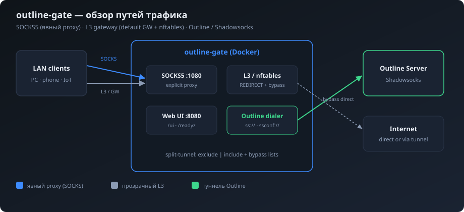
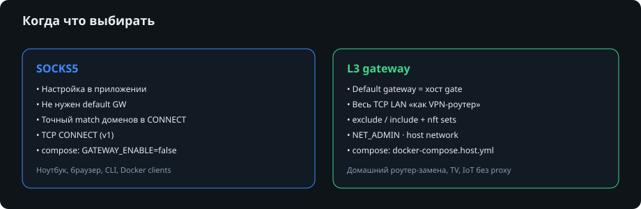
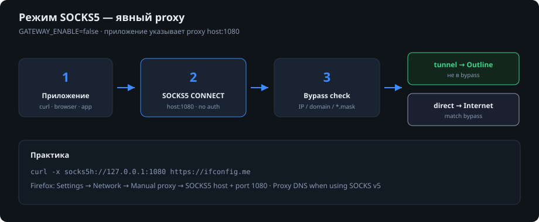
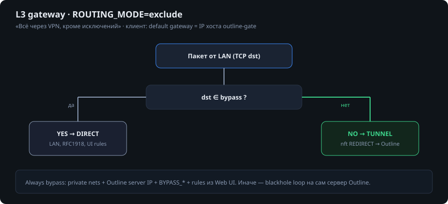
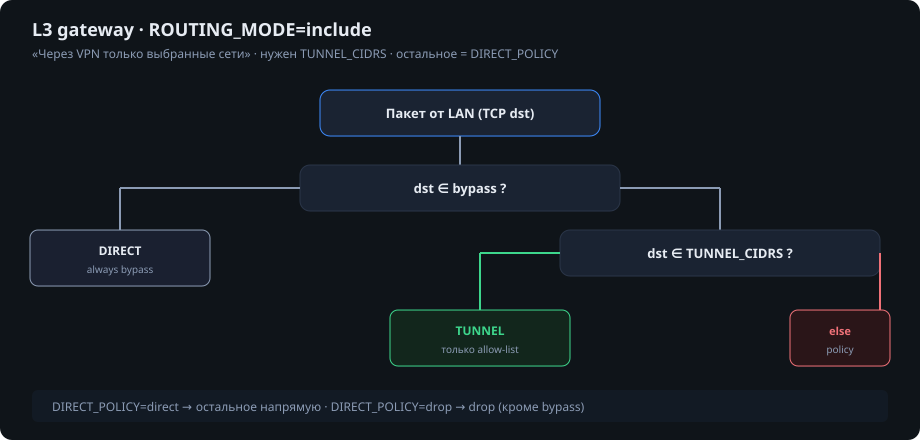
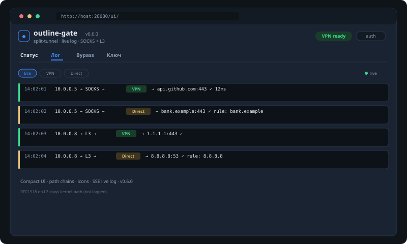

# outline-gate

[](https://github.com/unhexx/outline-gate/actions/workflows/ci.yml)
[](https://goreportcard.com/report/github.com/unhexx/outline-gate)
[](LICENSE)
[](go.mod)
[](https://github.com/unhexx/outline-gate/releases)

Docker LAN-шлюз к [Outline](https://getoutline.org/) (Shadowsocks): **SOCKS5**, опциональный **L3 split-tunnel** и **Web UI**.

<p align="center">
  
</p>

## Возможности

- Клиент Outline через **outline-sdk** (`ss://` и динамические `ssconf://`)
- Локальный **SOCKS5** (`:1080`) — явный proxy для приложений
- Опциональный **L3 gateway** (nftables): режимы `exclude` / `include`
- **Web UI** (`/ui/`): исключения (IP / CIDR / домены / `*.mask`) и **замена ключа Outline**
- Параметры: `.env`, volume-файлы, Docker secrets
- Health: `/healthz`, `/readyz` (без auth; API UI — с `UI_TOKEN`)

## Оглавление

1. [Быстрый старт](#быстрый-старт)
2. [SOCKS5 vs L3 — что выбрать](#socks5-vs-l3--что-выбрать)
3. [Использование SOCKS5](#использование-socks5)
4. [Использование L3 gateway](#использование-l3-gateway)
5. [Web UI](#web-ui)
6. [Переменные окружения](#основные-переменные)
7. [Сборка образа](#сборка-образа)
8. [Best practices](#best-practices)
9. [Документация](#документация)

---

## Быстрый старт

```bash
cd deploy/compose
cp .env.example .env
chmod +x configure.sh
./configure.sh          # ввод ss:// ключа и параметров

# Web UI (рекомендуется для LAN)
# в .env:
#   UI_ENABLE=true
#   UI_TOKEN=<длинный-секрет>
#   HOST_HEALTH_PORT=28080

docker compose up --build -d

curl -s http://127.0.0.1:28080/readyz
# UI: http://127.0.0.1:28080/ui/
curl -s --socks5h 127.0.0.1:1080 https://ifconfig.me
```

L3-шлюз (host network, клиенты LAN → IP хоста как default GW):

```bash
# в .env: GATEWAY_ENABLE=true
docker compose -f docker-compose.host.yml up --build -d
```

---

## SOCKS5 vs L3 — что выбрать

<p align="center">
  
</p>

| Критерий | SOCKS5 | L3 gateway |
|----------|--------|------------|
| Настройка клиента | proxy в приложении | default gateway / static route |
| Охват | только apps с proxy | почти весь TCP LAN-трафик |
| Compose | `docker-compose.yml`, `GATEWAY_ENABLE=false` | `docker-compose.host.yml`, `GATEWAY_ENABLE=true` |
| Привилегии | обычный Docker | `NET_ADMIN`, nftables, часто `network_mode: host` |
| Домены в bypass | **точный** match hostname | DNS → IP (best-effort) |
| UDP | не в v1 | не в v1 (TCP-first) |
| Типичный кейс | ноутбук, браузер, CLI | TV, IoT, «роутер с VPN» |

**Можно использовать оба сразу:** L3 для устройств без proxy + SOCKS для приложений на том же хосте.

---

## Использование SOCKS5

<p align="center">
  
</p>

### 1. Запуск (bridge, только SOCKS)

`deploy/compose/.env`:

```bash
OUTLINE_ACCESS_KEY=ss://...@server:port
ROUTING_MODE=exclude
GATEWAY_ENABLE=false
SOCKS_LISTEN=0.0.0.0:1080
HOST_SOCKS_PORT=1080
HOST_HEALTH_PORT=28080
UI_ENABLE=true
UI_TOKEN=ваш-секрет
```

```bash
cd deploy/compose
docker compose up --build -d
curl -s http://127.0.0.1:28080/readyz
```

Проверка, что egress идёт через Outline:

```bash
# без proxy — IP вашего ISP
curl -s https://ifconfig.me; echo

# через SOCKS — IP Outline-сервера (или egress VPN)
curl -s --socks5h 127.0.0.1:1080 https://ifconfig.me; echo
```

> Используйте **`socks5h`** (не `socks5`), чтобы DNS резолвился на стороне proxy — меньше DNS-утечек.

### 2. curl / wget

```bash
# HTTP(S) через SOCKS
curl -x socks5h://127.0.0.1:1080 https://example.com

# или
curl --socks5-hostname 127.0.0.1:1080 https://ifconfig.me

export ALL_PROXY=socks5h://127.0.0.1:1080
curl -s https://ifconfig.me
unset ALL_PROXY
```

С LAN-клиента (IP хоста Docker, например `192.168.1.10`):

```bash
curl -x socks5h://192.168.1.10:1080 https://ifconfig.me
```

### 3. Firefox

1. **Settings → Network Settings → Settings…**
2. **Manual proxy configuration**
3. **SOCKS Host:** `127.0.0.1` (или IP gate), **Port:** `1080`
4. Выберите **SOCKS v5**
5. Включите **Proxy DNS when using SOCKS v5**
6. OK → откройте https://ifconfig.me

### 4. Chromium / Chrome

Chrome не имеет встроенного SOCKS-UI. Варианты:

```bash
# Linux: отдельный профиль + proxy-server
google-chrome --user-data-dir=/tmp/chrome-socks \
  --proxy-server="socks5://127.0.0.1:1080" \
  https://ifconfig.me
```

Или расширение / системный proxy (зависит от ОС).

### 5. SSH over SOCKS (ProxyCommand / Dynamic)

Если нужен SSH *через* Outline:

```bash
# ssh с ProxyCommand + nc/connect через SOCKS
ssh -o ProxyCommand='nc -X 5 -x 127.0.0.1:1080 %h %p' user@remote-host
```

(набор `nc`/`ncat` зависит от дистрибутива; альтернатива — `connect-proxy`.)

### 6. Git через SOCKS

```bash
git config --global http.proxy socks5h://127.0.0.1:1080
git config --global https.proxy socks5h://127.0.0.1:1080
# отключить:
git config --global --unset http.proxy
git config --global --unset https.proxy
```

### 7. Docker-контейнер, ходящий наружу через SOCKS

```bash
docker run --rm curlimages/curl:latest \
  -x socks5h://172.17.0.1:1080 https://ifconfig.me
# 172.17.0.1 — типичный gateway docker0 к хосту; в LAN используйте IP хоста
```

### 8. Bypass в SOCKS

Если destination **совпал** с правилом bypass (IP/CIDR/домен/`*.mask` из UI или `BYPASS_*`), outline-gate dial'ит **напрямую**, минуя Outline. Иначе — через туннель.

```bash
# пример: добавить исключение в UI или:
# BYPASS_CIDRS=8.8.8.8/32
# BYPASS_RULES_FILE=/config/bypass.rules.txt  →  example.com
```

### 9. Безопасность SOCKS

- **Нет пароля SOCKS** в v1 — публиковать `:1080` в интернет **нельзя**.
- Ограничьте firewall: только LAN / `127.0.0.1`.
- Не коммитьте `.env` с ключами.

---

## Использование L3 gateway

L3-режим делает хост **маршрутизатором**: LAN-клиенты ставят **default gateway** (или policy route) на IP машины с outline-gate. nftables решает: redirect TCP в transparent proxy → Outline, или оставить direct.

### Предпосылки

- Linux-хост в той же L2/L3 сети, что и клиенты
- `GATEWAY_ENABLE=true`
- Обычно: `docker compose -f docker-compose.host.yml` (`network_mode: host`)
- Capability `NET_ADMIN`, `ip_forward=1`
- Клиенты: IPv4 gateway = LAN IP хоста (пример: `192.168.1.10`)

### Запуск (host network)

`deploy/compose/.env`:

```bash
OUTLINE_ACCESS_KEY=ss://...@server:port
GATEWAY_ENABLE=true
ROUTING_MODE=exclude          # или include
# LAN_INTERFACE=eth0          # опционально, для MASQUERADE oif
HOST_HEALTH_PORT=28080        # при host network порты слушаются напрямую
UI_ENABLE=true
UI_TOKEN=ваш-секрет
```

```bash
cd deploy/compose
docker compose -f docker-compose.host.yml up --build -d
curl -s http://127.0.0.1:8080/readyz   # при host: HEALTH_LISTEN как есть
# или http://192.168.1.10:8080/readyz
```

### Настройка клиента (пример Linux)

```bash
# предположим, хост gate: 192.168.1.10, интерфейс клиента eth0
sudo ip route replace default via 192.168.1.10 dev eth0

# DNS (важно: DNS-утечки не «лечатся» L3 автоматически)
# либо router DNS, либо 1.1.1.1 — осознанно
```

**Windows (GUI):**  
Параметры → Сеть → Свойства адаптера → IPv4 → Шлюз: `192.168.1.10`.

**Android / iOS:**  
Статический IP Wi‑Fi → Router / Gateway = IP host с outline-gate.

### Проверка L3

На клиенте (без SOCKS):

```bash
curl -s https://ifconfig.me; echo
# при exclude + рабочем туннеле — IP Outline egress
# при доступе к 192.168.x.x — direct (bypass RFC1918)
```

На хосте:

```bash
docker logs outline-gate --tail=50
# table nft (host network):
sudo nft list table inet outline_gate
```

Остановка / сброс правил:

```bash
docker compose -f docker-compose.host.yml down
# при аварийном kill:
sudo nft delete table inet outline_gate
```

---

### Режим `exclude` (по умолчанию)

<p align="center">
  
</p>

**Смысл:** весь TCP (не из bypass) → туннель Outline.  
Идеально: «VPN на всю квартиру, кроме локалки и выбранных сервисов».

```bash
ROUTING_MODE=exclude
GATEWAY_ENABLE=true
# опционально доп. исключения:
BYPASS_CIDRS=203.0.113.0/24
# или через Web UI: example.com, *.cdn.example.net
```

**Логика:**

```text
if dst ∈ bypass (RFC1918 + UI + BYPASS_* + IP Outline-сервера)
    → DIRECT
else
    → TUNNEL (nft REDIRECT → Outline)
```

**Практика: исключить банк / внутренний API**

1. Web UI → добавить `bank.example.com` или `10.50.0.0/16`
2. Или файл `/config/bypass.rules.txt`:

```text
bank.example.com
203.0.113.0/24
```

3. SIGHUP / UI apply / DNS refresh — L3 set обновится.

---

### Режим `include`

<p align="center">
  
</p>

**Смысл:** через VPN **только** адреса из `TUNNEL_*`. Остальное — `DIRECT_POLICY` (`direct` или `drop`).  
Идеально: «только зарубежные сервисы / офисные CIDR через Outline, остальной интернет — как был».

```bash
ROUTING_MODE=include
GATEWAY_ENABLE=true
TUNNEL_CIDRS=8.8.8.8/32,203.0.113.0/24
# или TUNNEL_CIDRS_FILE=/config/tunnel.txt
DIRECT_POLICY=direct
```

**Логика:**

```text
if dst ∈ bypass          → DIRECT
elif dst ∈ tunnel list   → TUNNEL
else                     → DIRECT_POLICY  # direct | drop
```

**Практика: только Google DNS и одна подсеть через VPN**

```bash
# .env
ROUTING_MODE=include
TUNNEL_CIDRS=8.8.8.8/32,8.8.4.4/32,203.0.113.0/24
DIRECT_POLICY=direct
GATEWAY_ENABLE=true
```

```bash
# на клиенте с GW=gate
curl -s --connect-to ifconfig.me:443:8.8.8.8:443 https://ifconfig.me   # не показательно
# проще: traceroute / tcpdump; для 8.8.8.8 TCP уйдёт в tunnel set
```

**`DIRECT_POLICY=drop`:** всё, что не bypass и не tunnel, **режется** (жёсткий allow-list). Осторожно: легко «убить» интернет на клиентах, если tunnel-список неполный.

```bash
DIRECT_POLICY=drop
TUNNEL_CIDRS=1.2.3.0/24
# клиент достучится до 1.2.3.0/24 через Outline; 8.8.8.8 — drop
```

---

### L3: ограничения v1

| Тема | Поведение |
|------|-----------|
| Протоколы | TCP redirect; **UDP не полный** |
| Домены в bypass | резолв A/AAAA + refresh (`BYPASS_DNS_REFRESH`); редкие поддомены могут кратко уйти в tunnel |
| IPv6 | nft path ориентирован на IPv4 |
| DNS | не «магический tunnel DNS»; настраивайте DNS на клиентах отдельно |
| Always bypass | RFC1918, CGNAT, link-local, IP сервера Outline |

Подробнее: [`docs/routing.md`](docs/routing.md).

---

## Web UI

<p align="center">
  
</p>

### Вход: логин и пароль по умолчанию

**Отдельного логина/пароля нет** — и **нет учётных данных по умолчанию** (`admin` / `password` не существуют).

| Что | По умолчанию |
|-----|----------------|
| Web UI | **выключен** (`UI_ENABLE=false`) |
| Логин | **не используется** |
| Пароль / токен | **задаёте сами** в `UI_TOKEN` |

```bash
# deploy/compose/.env
UI_ENABLE=true
UI_TOKEN=ваш-длинный-случайный-секрет
HOST_HEALTH_PORT=28080
```

```bash
openssl rand -hex 24   # → в UI_TOKEN
docker compose up -d --force-recreate
# http://127.0.0.1:28080/ui/  → поле «Токен доступа» = UI_TOKEN
```

**Авторизация API**

| Способ | Как |
|--------|-----|
| Форма UI | `UI_TOKEN` → sessionStorage → `Authorization: Bearer …` |
| curl | `Authorization: Bearer <UI_TOKEN>` |
| HTTP Basic | username любой (`admin`), **password** = `UI_TOKEN` |

| URL | Auth | Назначение |
|-----|------|------------|
| `/ui/` | токен для API | SPA |
| `GET/PUT /api/v1/outline` | Bearer / Basic | статус / замена ключа |
| `GET/POST/DELETE /api/v1/bypass` | Bearer / Basic | правила исключений |
| `/healthz`, `/readyz` | нет | healthcheck |

Ключ, заменённый в UI → `OUTLINE_KEY_PERSIST_FILE` (по умолчанию `/config/outline_key.runtime.txt`), при старте **приоритетнее** `OUTLINE_ACCESS_KEY`.

---

## Основные переменные

| Variable | Description |
|----------|-------------|
| `OUTLINE_ACCESS_KEY` / `OUTLINE_ACCESS_KEY_FILE` | Ключ Outline `ss://` или `ssconf://` |
| `OUTLINE_KEY_PERSIST_FILE` | Файл ключа после замены в UI |
| `ROUTING_MODE` | `exclude` \| `include` |
| `BYPASS_CIDRS` / `BYPASS_CIDRS_FILE` | Статические CIDR-исключения |
| `BYPASS_RULES_FILE` | User-правила (IP/домены) UI |
| `TUNNEL_CIDRS` / `TUNNEL_CIDRS_FILE` | Цели (include) |
| `DIRECT_POLICY` | `direct` \| `drop` (include) |
| `GATEWAY_ENABLE` | L3 nftables |
| `UI_ENABLE` / `UI_TOKEN` | Web UI + API |
| `HOST_SOCKS_PORT` / `HOST_HEALTH_PORT` | Порты на хосте (bridge compose) |
| `SOCKS_LISTEN` / `HEALTH_LISTEN` | Слушатели в контейнере |
| `LOG_LEVEL` | `debug` / `info` / `warn` / `error` |

Полный список: [`deploy/compose/.env.example`](deploy/compose/.env.example).

---

## Сборка образа

```bash
docker build -f deploy/docker/Dockerfile -t outline-gate:local .
```

Ключ **не** вшивается в образ:

```bash
docker run --rm -d --name outline-gate \
  --cap-add=NET_ADMIN \
  -e OUTLINE_ACCESS_KEY='ss://...' \
  -e ROUTING_MODE=exclude \
  -e GATEWAY_ENABLE=false \
  -e UI_ENABLE=true \
  -e UI_TOKEN='change-me' \
  -p 1080:1080 -p 28080:8080 \
  -v "$PWD/deploy/compose/config:/config" \
  outline-gate:local
```

---

## Best practices

1. **Секреты** — `.env` / secrets / UI persist-файл; никогда в git и образ.
2. **UI_TOKEN** — длинный случайный; UI/API не в публичный интернет без TLS reverse-proxy.
3. **SOCKS `:1080`** — только LAN / localhost; auth SOCKS в v1 нет.
4. **L3** — всегда auto-bypass IP Outline-сервера; проверяйте после смены ключа.
5. **Домены на L3** — best-effort; для точного hostname-match используйте SOCKS.
6. **Обновления** — `docker compose up --build -d`; rules в volume `./config`.
7. **DNS** — настройте отдельно; L3 не заменяет DoH/DoT-политику.

---

## Документация

| Документ | Содержание |
|----------|------------|
| **[docs/OPERATIONS.ru.md](docs/OPERATIONS.ru.md)** | Пошаговое развёртывание (RU) |
| [docs/architecture.md](docs/architecture.md) | Архитектура |
| [docs/deployment.md](docs/deployment.md) | Профили сети A/B/C |
| [docs/routing.md](docs/routing.md) | Режимы маршрутизации и bypass |
| [docs/images/](docs/images/) | Схемы и иллюстрации для README |

## Репозиторий

- GitHub: https://github.com/unhexx/outline-gate
- Origin: `git.aservice24.ru`

```bash
git clone https://github.com/unhexx/outline-gate.git
cd outline-gate
```

## Безопасность

- SOCKS без auth — только доверенная сеть
- Не коммитьте `.env`, `*.runtime.txt` и реальные ключи
- В логах ключ редактируется (`ss://***@host:port`)
- API UI без токена → `401`

## License

MIT
